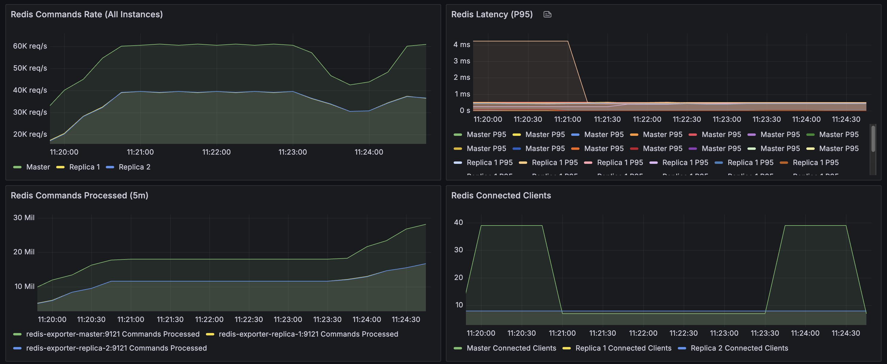

# Redis HA Performance Testing

A complete Redis High Availability (HA) performance testing environment with Master-Replica setup, Sentinel failover, and comprehensive monitoring using **memtier_benchmark**.

## Screenshots



## 🚀 Quick Start

### 1. Start Infrastructure
```bash
./start.sh
```
This starts all services: Redis Master, 2 Replicas, 3 Sentinels, Prometheus, Grafana, and memtier_benchmark.

### 2. Run Performance Tests
```bash
# Run a specific test scenario
./test-memtier.sh baseline
./test-memtier.sh read-heavy
./test-memtier.sh write-heavy
./test-memtier.sh mixed

# Or run all test scenarios
./test-memtier.sh all
```

### 3. View Results
- **Grafana Dashboard**: http://localhost:3000 (admin/admin)
- **Prometheus**: http://localhost:9090
- **Test Results**: `./results/` directory (JSON and TXT formats)

### 4. Stop Everything
```bash
docker compose down
```

## 📊 Test Scenarios

| Scenario      | Description                 | Read/Write Ratio | Operations/sec |
| ------------- | --------------------------- | ---------------- | -------------- |
| `baseline`    | Balanced GET/SET operations | 1:1 (50% / 50%)  | ~100K+         |
| `read-heavy`  | Read-intensive workload     | 4:1 (80% / 20%)  | ~140K+         |
| `write-heavy` | Write-intensive workload    | 1:4 (20% / 80%)  | ~100K+         |
| `mixed`       | Balanced workload           | 1:1 (50% / 50%)  | ~100K+         |

## 🏗️ Architecture

```
┌─────────────────┐    ┌─────────────────┐    ┌─────────────────┐
│   Redis Master  │    │  Redis Replica  │    │  Redis Replica  │
│   (Write)       │◄───┤  1 (Read)       │    │  2 (Read)       │
└─────────────────┘    └─────────────────┘    └─────────────────┘
         │                       │                       │
         └───────────────────────┼───────────────────────┘
                                 │
         ┌──────────────────────────────────────────────────┐
         │              Redis Sentinels                     │
         │  ┌─────────────┐ ┌─────────────┐ ┌─────────────┐ │
         │  │ Sentinel 1  │ │ Sentinel 2  │ │ Sentinel 3  │ │
         │  │ (Failover)  │ │ (Failover)  │ │ (Failover)  │ │
         │  └─────────────┘ └─────────────┘ └─────────────┘ │
         └──────────────────────────────────────────────────┘
                                 │
         ┌──────────────────────────────────────────────────┐
         │              Performance Testing                 │
         │  ┌─────────────────────────────────────────────┐ │
         │  │        memtier_benchmark                    │ │
         │  │  (Redis Labs Official Benchmark Tool)       │ │
         │  └─────────────────────────────────────────────┘ │
         └──────────────────────────────────────────────────┘
                                 │
         ┌───────────────────────────────────────────────────┐
         │                Monitoring                         │
         │  ┌─────────────┐ ┌─────────────┐ ┌──────────────┐ │
         │  │ Prometheus  │ │   Grafana   │ │Redis Exporter│ │
         │  │ (Metrics)   │ │ (Dashboard) │ │  (Metrics)   │ │
         │  └─────────────┘ └─────────────┘ └──────────────┘ │
         └───────────────────────────────────────────────────┘
```

## 📈 Performance Results

### Baseline Test Results (Sample)
- **Total Throughput**: 103,251 ops/sec
- **SET Operations**: 51,625 ops/sec
- **GET Operations**: 51,625 ops/sec
- **Average Latency**: 0.21ms
- **P99 Latency**: 0.37ms
- **P99.9 Latency**: 0.95ms

### Read-Heavy Test Results (Sample)
- **Total Throughput**: 144,451 ops/sec
- **SET Operations**: 28,890 ops/sec
- **GET Operations**: 115,561 ops/sec
- **Average Latency**: 0.22ms
- **P99 Latency**: 0.37ms
- **P99.9 Latency**: 0.95ms

## 🔧 Configuration

### Redis Settings
- **Memory**: 2GB per node with LRU eviction
- **Persistence**: AOF with every-second fsync
- **Replication**: Asynchronous with failover support

### Sentinel Settings
- **Quorum**: 2/3 majority for failover decisions
- **Down Detection**: 5 seconds
- **Failover Timeout**: 10 seconds

### memtier_benchmark Settings
- **Threads**: 4 concurrent threads
- **Clients per Thread**: 8 clients
- **Requests per Client**: 10,000 requests
- **Data Size**: 100 bytes per value
- **Key Pattern**: Random distribution
- **Key Range**: 1-100,000 keys

### Docker Resources
- **Redis Nodes**: 2GB memory limit
- **Sentinels**: 256MB memory limit
- **Monitoring**: 1GB Prometheus, 512MB Grafana
- **memtier_benchmark**: 512MB memory limit

## 📁 Project Structure

```
redis-cluster-performance-test/
├── start.sh                    # Start infrastructure
├── test-memtier.sh             # Run memtier_benchmark tests
├── docker-compose.yml          # Service definitions
├── redis/                      # Redis configurations
│   ├── master.conf
│   ├── replica-1.conf
│   └── replica-2.conf
├── sentinel/                   # Sentinel configurations
│   ├── sentinel-1.conf
│   ├── sentinel-2.conf
│   └── sentinel-3.conf
├── monitoring/                 # Monitoring stack
│   ├── prometheus.yml
│   └── grafana/
├── results/                    # Test results (JSON/TXT)
└── README.md                   # This file
```

## 🛠️ Development

### Manual Testing
```bash
# Connect to Redis master
docker exec -it redis-master redis-cli

# Check Sentinel status
docker exec -it redis-sentinel-1 redis-cli -p 26379 sentinel master mymaster

# View logs
docker-compose logs -f redis-master
```

### Custom memtier_benchmark Commands
```bash
# Run a custom test
docker run --rm \
    --network redis-cluster-performance-test_redis-network \
    -v $(pwd)/results:/results \
    redislabs/memtier_benchmark:latest \
    --server=redis-master \
    --port=6379 \
    --protocol=redis \
    --threads=8 \
    --clients=16 \
    --requests=50000 \
    --ratio=3:1 \
    --data-size=200 \
    --key-pattern=R:R \
    --out-file=/results/custom-test.txt
```

### Troubleshooting

**Infrastructure won't start:**
```bash
# Check Docker status
docker info

# Clean up and restart
docker compose down -v
./start.sh
```

**Tests failing:**
```bash
# Check Redis connectivity
docker exec redis-master redis-cli ping

# Check Sentinel status
docker exec redis-sentinel-1 redis-cli -p 26379 ping
```

**Dashboard not loading:**
```bash
# Check Grafana logs
docker compose logs grafana

# Restart monitoring services
docker compose restart prometheus grafana
```

## 📝 License

This project is for educational and testing purposes. Redis is licensed under the BSD license. 